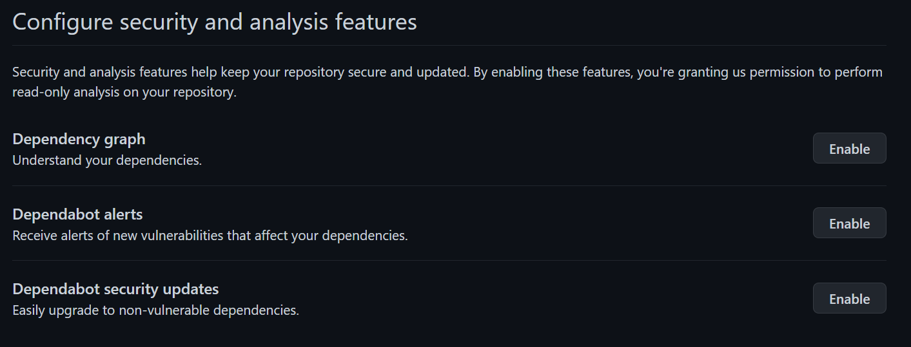
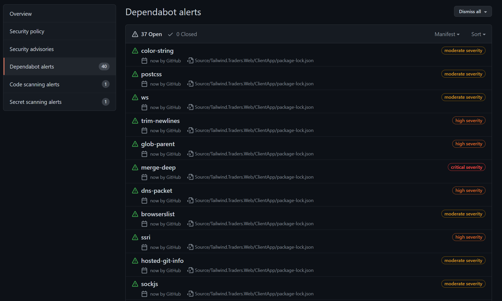
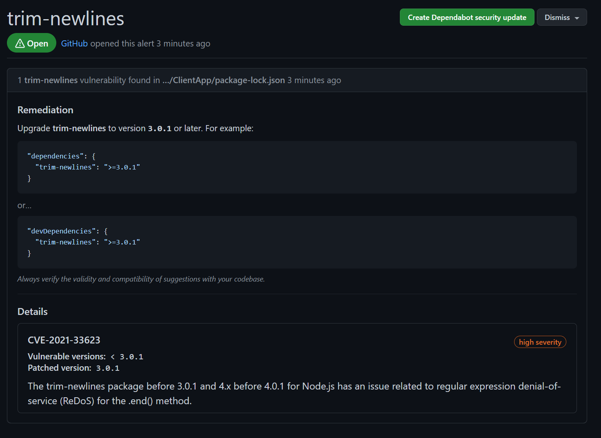
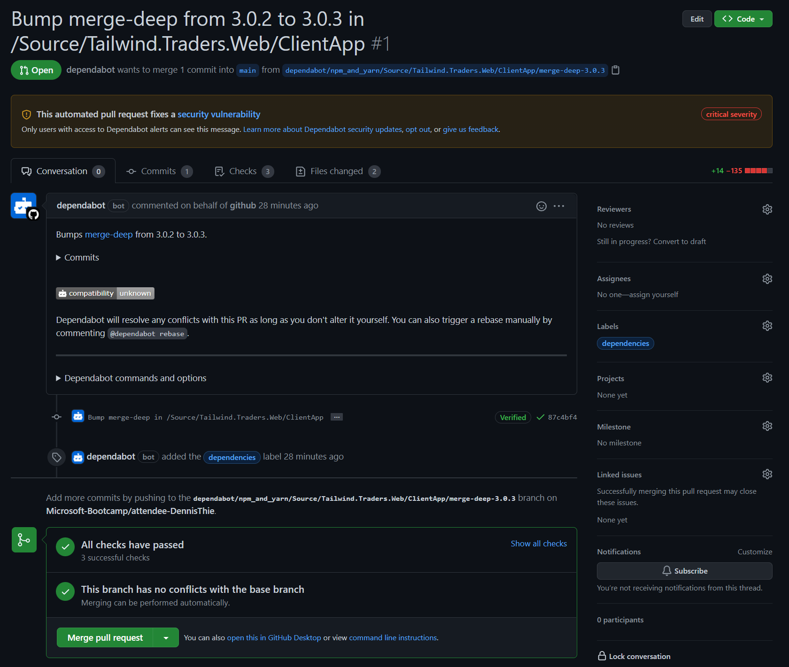

# 7 Enabling and using Dependabot on your repository
The hands-on lab has the goal to learn you how to enable the Dependency and Dependabot features and gain hands-on experience with Dependatbot's ability to update your dependencies automatically.

This hands on lab consists of the following steps:
- [Enabling the Dependency features](#enabling-the-dependency-features)
- [Dependabot alerts](#dependabot-alerts)
- [If time permits: Always assign Dependabot alerts to a person for review](#if-time-permits-always-assign-dependabot-alerts-to-a-person-for-review)

## Enabling the Dependency features
Let's start with enabling the following features on your repository. When you navigate to the `Settings` tab on your repository, under the `Configure security and analysis features` you will find the following features. Go ahead and click `Enable` for each of these features:
* Dependency graph
* Dependabot alerts
* Dependabot security updates



Now that you have enabled the Dependabot features, let's have some hands-on experience with this functionality.

## Dependabot alerts
Dependabot alerts track security vulnerabilities that apply to your repository’s dependencies. When you navigate to the `Security` tab on your repository, and click `Dependabot alerts`, you can see the active alerts generated by Dependabot.



When you click on an alert, you can see the details on that alert. Let's have a look at an example alert. Dependabot will show you details on the vulnerability and a suggested remediation. Review the details of the vulnerability and, if available, the pull request containing the automated security update. Optionally, if there isn't already a Dependabot security updates update for the alert, to create a pull request to resolve the vulnerability, click `Create Dependabot security update`.



A pull request with regards to a security update will always be generated by the Dependabot bot user. Navigate to the pull request that was generated by the Dependabot bot user. Here's an example:



When you're ready to update your dependency and resolve the vulnerability, merge the pull request. 

## If time permits: Always assign Dependabot alerts to a person for review
By default, Dependabot raises pull requests without any reviewers or assignees. In this part of the hands-on lab, let's make use of the ability to configure Dependabot to always assign Dependabot alerts to a person. You can perform this kind of configuration using the `dependabot.yml` file. You must store this file in the `.github` directory of your repository. When you add or update the `dependabot.yml` file, this triggers an immediate check for version updates.

You can use reviewers and assignees to specify reviewers and assignees for all pull requests raised. You can also specify a team but when you specify a team, you must use the full team name, as if you were @mentioning the team (including the organization). 

The example `dependabot.yml` file below changes the npm configuration so that all pull requests opened with version and security updates for npm will have two reviewers and one assignee.

```
# dependabot.yml file with
# reviews and an assignee for all npm pull requests

version: 2
updates:
  # Keep npm dependencies up to date
  - package-ecosystem: "nuget"
    directory: "/code/"
    schedule:
      interval: "daily"
    # Raise all npm pull requests with reviewers
    # Enter your GitHub username
    reviewers:
      - "user-name"
    # Raise all npm pull requests with an assignee
     # Enter your GitHub username
    assignees:
      - "user-name"
```

Now, go ahead and try to always assign Dependabot alerts to yourself using configuration via the `dependabot.yml` file.

For more information, please refer to: [https://docs.github.com/en/code-security/supply-chain-security/keeping-your-dependencies-updated-automatically/customizing-dependency-updates](https://docs.github.com/en/code-security/supply-chain-security/keeping-your-dependencies-updated-automatically/customizing-dependency-updates)
diff --git a/day-2/2.2-dependabot.md b/day-2/2.2-dependabot.md
